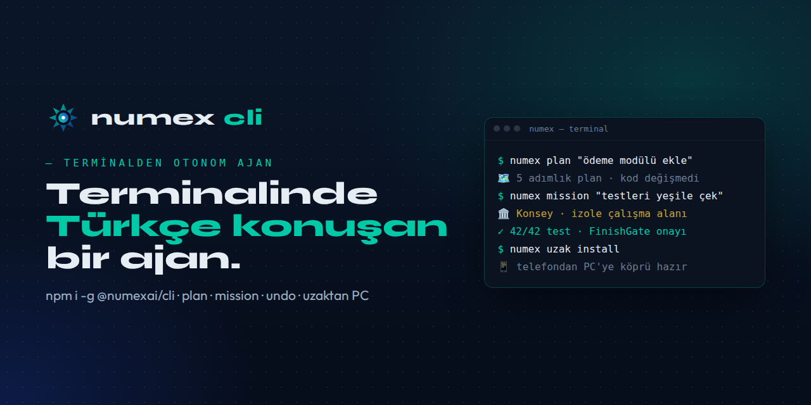
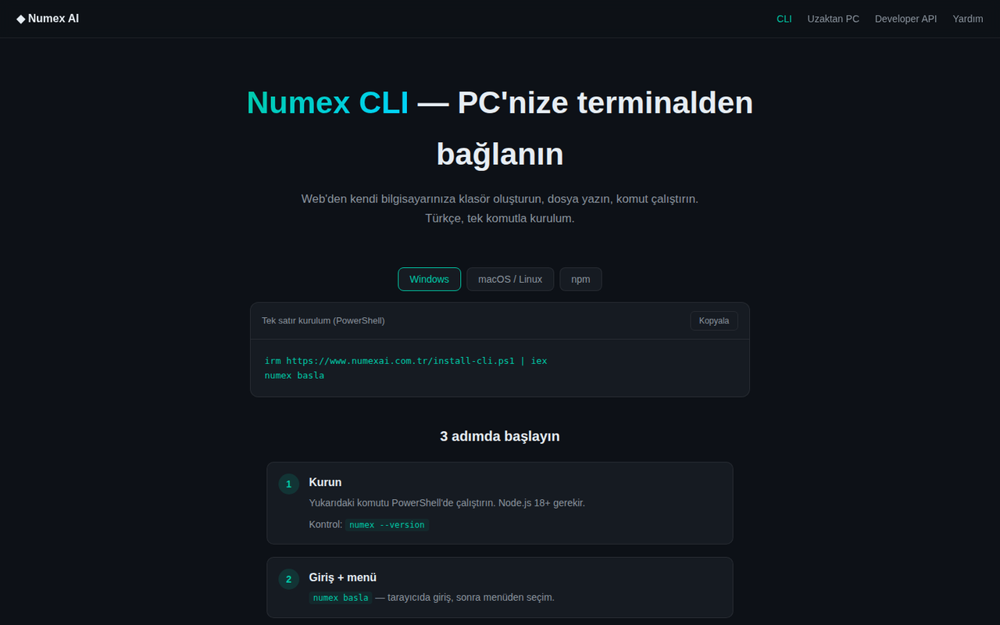
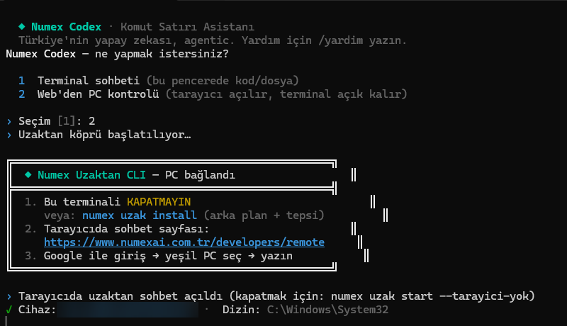
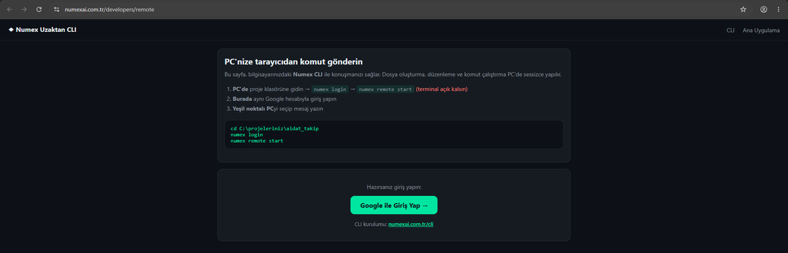

<div align="center">



# ⌨️ Numex CLI

### Terminalinde Türkçe konuşan, otonom bir kod ajanı.

[](https://www.npmjs.com/package/@numexai/cli)
[](https://codex.numexai.com.tr)
[](https://github.com/numexai/numex-codex)

</div>

---

```bash
npm i -g @numexai/cli
numex login
numex "koyu temalı bir yapılacaklar uygulaması yap"
```

Numex CLI, [Numex Codex](https://github.com/numexai/numex-codex)'in terminaldeki yüzü. Karmaşık işlerde
4 uzmanlı **Konsey** (Mimar · Kodlayıcı · Denetçi · Tasarımcı) ile çalışır ve **kanıtsız "bitti" demez** —
[Konsey nasıl çalışır? →](https://github.com/numexai/numex-codex/blob/main/docs/konsey.md)

**Terminal ve IDE'ler için Türkçe, otonom, ajan tabanlı kodlama asistanı.**
Lisans: MIT · Paket: `@numexai/cli`


*`numex` → Terminal sohbeti: Selçuklu yıldızı logosu, sunucu, proje kökü, sürüm, mod ve model bilgisi.*

## Kurulum

```bash
# npm (Node.js 18+)
npm install -g @numexai/cli

# Windows tek satır (PowerShell)
irm https://www.numexai.com.tr/install-cli.ps1 | iex

numex --version
numex basla     # tarayıcıda giriş + başlangıç menüsü
```



## Temel komutlar

| Komut | Ne yapar? |
|---|---|
| `numex` | Etkileşimli REPL (terminal sohbeti) |
| `numex basla` | Giriş + menü |
| `numex login` | Hesaba giriş |
| `numex "<görev>"` | Tek seferlik görev: `numex "React e-ticaret arayüzü oluştur"` |
| `numex plan "<görev>"` | **Mimar planlayıcı** — kod değiştirmeden plan üretir |
| `numex mission "<görev>"` | **Uzun süreli otonom misyon** — izole sandbox worktree'lerde |
| `numex undo` | Son turu tek tıkla geri al |
| `numex --offline "<görev>"` | Yerel Ollama ile çevrimdışı mod |
| `numex --api-key nx_live_…` | API anahtarı ayarla |
| `numex --devam` | Son oturumdan devam |
| `/model fast \| pro \| code` | Aktif profili kilitle |

## Uzaktan PC köprüsü

Telefonunuzdan veya başka bir cihazdan **kendi bilgisayarınıza** klasör oluşturun, dosya yazın,
komut çalıştırın.

```bash
numex uzak             # köprüyü başlat (terminal açık kalsın)
numex uzak install     # arka plan servisi — terminal kapansa da çalışır, sistem tepsisinde ikon
numex uzak pause       # duraklat
```






Ardından web'deki **developers/remote** sayfasından yazın. Bağlantıda cihaz ID'si ve sohbet linki
terminalde görünür.

## Öne çıkan mühendislik

| Özellik | Açıklama |
|---|---|
| ✂️ **Surgical Fast-Patching** | Unified diff hunk ve satır aralığı çapalarıyla cerrahi kod değişiklikleri — dosyanın tamamını yeniden yazmaz. |
| 🛰️ **Live Subshell Intercept** | Arka plandaki node/vite/npm süreç hatalarını ~2 saniyede yakalar ve kendini toparlar. |
| 🌳 **Tree-View Live Progress** | Görev adımlarını canlı ağaç görünümünde gösterir. |
| 🚦 **FinishGate** | Görev "bitti" sayılmadan önce **canlı kanıt** ister: HTTP 200, birim testleri, DOM kontrolleri. |
| 🔎 **RAG kod indeksleme** | BM25 + AST grafiğiyle kod tabanında anlamlı arama. |
| 🔌 **MCP istemcisi** | Model Context Protocol ile dosya sistemi ve git araçları (`mcp.json`). |
| 🧑‍🤝‍🧑 **İnsan-yoldaş modu** | "Önce anlaşalım, sonra yapalım": otonom modda bile onay alır. |
| 🧾 **Denetim izi & checkpoint** | Her tur kaydedilir; geri alınabilir. |
| 🔀 **Git entegrasyonu** | Commit, PR açma, issue → PR hattı. |

## Kişilik

Numex Codex'in kişilik tanımı: *"Önce insan, sonra iş yapan."* Kullanıcıyı dinler, "şunu mu demiştin?"
diye sorar, yol haritasını birlikte çizer, hata yaparsa kabul edip yol gösterir. Kullanıcının
ruh halini (stres, yorgunluk, heyecan) fark edip tempo ayarlar.

## Kimler için?

- Terminalde yaşayan geliştiriciler
- Türkçe açıklama ve Türkçe kod yorumu isteyen ekipler
- Bilgisayarına uzaktan (telefondan) iş yaptırmak isteyenler
- CI/CD ve otomasyon hatlarına ajan eklemek isteyenler ([SDK](https://github.com/numexai/numex-sdk))

---

<div align="center">

**Numex Ailesi** · [Numex AI](https://numexai.com.tr) · [Codex](https://github.com/numexai/numex-codex) · [Okul](https://github.com/numexai/numex-okul) · [Market](https://market.numexai.com.tr) · [Numexpedia](https://github.com/numexai/numex-pedia) · [Hub](https://github.com/numexai/numex-hub) · [Forge](https://github.com/numexai/numex-forge) · [API](https://github.com/numexai/numex-api) · [SDK](https://github.com/numexai/numex-sdk) · [Pusulam](https://github.com/mobilcep/pusulamx) · [PC Doktoru](https://github.com/mobilcep/pcdoktoru)

*İnsanı önce koyan Türk yapay zekâsı* 🇹🇷 · [Tüm ekosistem →](https://github.com/numexai/numex_nedir)

</div>
